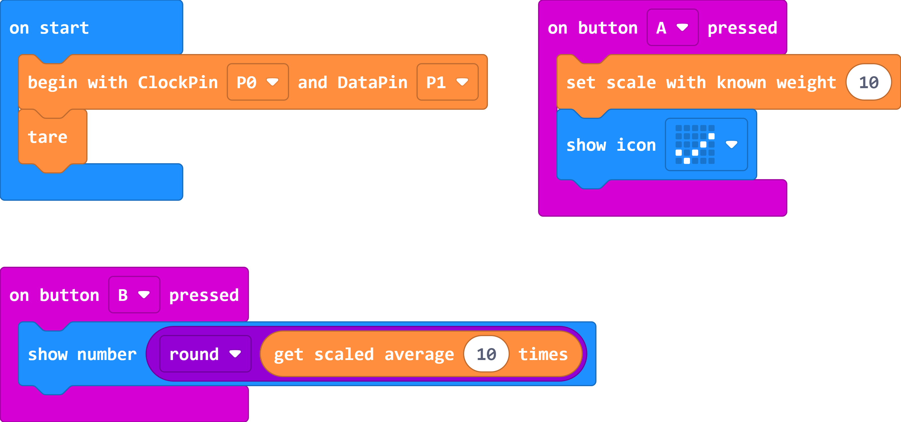

# BBC micro:bit MakeCode editor extension for HX711 connected to weight sensors

[HX711](https://www.mouser.com/datasheet/2/813/hx711_english-1022875.pdf) Based on Avia Semiconductor’s patented technology, HX711 is a precision 24-bit analog-to-digital converter (ADC) designed for weigh scales and industrial control applications to interface directly with a bridge sensor.

This extension allows you to use an HX711 module with the micro:bit as a weighing machine.

Original HX711 extension by daferdur:  https://github.com/daferdur/pxt-myHX711

## Synopsis

The library myHX711 provides a set of functions to allow you to measure weight.

## begin

||begin with ClockPin __ and DataPin __||

This block function sets the module to begin readings. Required in the "on start" block.

## Tare

||tare (set zero)||

This block function tares to zero with 10 readings, applying an offset to set the zero.

## Set Offset

||Set Offset||

This block function sets the configured offset to apply to the readings.

## Set Scale

||Set Scale with known weight||

This block function sets the configured scale. It depends on the cell used.

## Read

||Read raw data||

This block function reads an integer out without any taring or offset in the reading.

## read raw average

||read raw average N times||

This block function makes "N" number of integer readings without any taring or offset neither scaling in the readings and calculates an average.

## get scaled average

||get scaled average N times||

This block function gets the final value of the weight applying the configured scale and offset. N parameter must be higher than 1. The returned result will be N averaged.


## Example



### Blocking mode
The library is usually used in blocking mode, i.e. it will wait for the
hardware to become available before returning a reading.

```
// 1. HX711 circuit wiring
Select Data Pin;
Select Clock Pin;

// 2. Adjustment settings and Initialization of the library
begin();
setscale = 2000;
set_offset = 50682624;

// 3. Acquire reading
Serial print("Weight: ");
Serial print line(get N averaged final scaled value(10));

```

# From original version

## How to calibrate your load cell
1. Call `set_scale(Cell Full Scale)`, for example, for a 2kg cell, start with 2000.
2. Call `tare` to tare it with 10 readings.
3. Place a known weight on the scale and call `get_N_average_reading_units(10)`.
4. Divide the result in step 3 to your known weight. You should
   get about the parameter you need to pass to `set_scale(XX)`.
5. Adjust the parameter in step 4 until you get an accurate reading.


For example, if you put a weight of 100g and you get a reading of 104g, you should do 104/100 and multiply the result by scale to set again the scale as commented above.

## Credits
Thanks to Weihong Guan who started the first version of this library in 2012
already (see [[arduino|module]Hx711 electronic scale kit](http://aguegu.net/?p=1327),
[sources](https://github.com/aguegu/ardulibs/tree/master/hx711)), Bogdan Necula
who took over in 2014 and last but not least all others who contributed to this
library over the course of the last years.

#### See also
My codes are based on [Arduino sources - 2018 Bogdan Necula](https://github.com/bogde/HX711) Which I've translated from Arduino C to Microbit Makecode (Typescript).


## Sensor wiring

The Load Cell Amplifier is a small breakout board for the HX711 IC that allows you to easily read load cells to measure weight. By connecting the amplifier to your microcontroller you will be able to read the changes in the resistance of the load cell and with some calibration you’ll be able to get very accurate weight measurements. This can be handy for creating your own industrial scale, process control, or simple presence detection of an object.

The HX711 uses a two wire interface (Clock and Data) for communication. Any microcontroller’s GPIO pins should work and numerous libraries have been written making it easy to read data from the HX711.

Load cells use a four wire wheatstone bridge to connect to the HX711. These are commonly colored RED, BLK, WHT, GRN. Each color corresponds to the conventional color coding of load cells:

- Red (Excitation+)
- Black (Excitation-)
- White (Amplifier-)
- Green (Amplifier+)

If you invert White & Green wires you'll get reading with negative sign.


## HOW TO MOUNT - EXAMPLE

You can follow this example to make an implementation of a weighing machine.


## License

MIT

## Supported targets

* for PXT/microbit
(The metadata above is needed for package search.)

